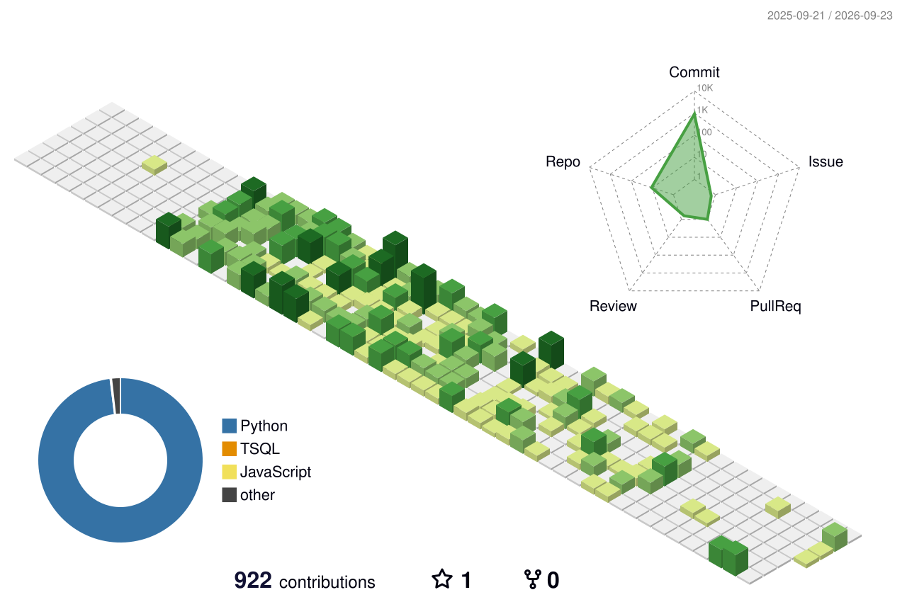

<div align="center">

# Hey, I'm Bhakti Chandak 👋

### Computer Science Student • AI/ML • Software Engineering • Systems


<br/>

<a href="https://www.linkedin.com/in/bhakti-chandak-b1a80030b/">

</a>
<a href="https://github.com/bhaktiichandak">

</a>
<a href="mailto:bhaktichandak04@gmail.com">

</a>

</div>

---

## 👩‍💻 About Me

I'm a Computer Science student at **RCOEM, Nagpur**, interested in
**Artificial Intelligence, Software Engineering, Data Engineering, and Systems**.

I enjoy understanding how things work under the hood and turning what I
learn into projects.

- 🎓 B.Tech in Computer Science & Engineering
- 🤖 GenAI / ML enthusiast
- 🧪 Interested in model evaluation, testing and robustness
- 🗄️ Interested in data engineering and ETL systems
- 🐧 Exploring Linux and systems programming
- 🍞 Currently building **ToastOS**, my own operating system

---

## 🛠️ Tech Stack

### 💻 Languages

<p>

</p>

### 🤖 AI / Machine Learning

<p>

</p>

`LangChain` • `CrewAI` • `OpenAI APIs` • `Hugging Face` • `RAG`

### 📊 Data & Analytics

<p>

</p>

`Pandas` • `NumPy` • `PySpark` • `Power BI` • `ETL` • `Data Warehousing`

### ⚙️ Development & Infrastructure

<p>

</p>

`REST APIs` • `GitHub Actions` • `CI/CD`

---

# 🚀 Featured Projects

<div align="center">

<a href="https://github.com/bhaktiichandak">

</a>

<a href="https://github.com/bhaktichandak">

</a>

</div>

### 🍞 ToastOS

> A personal operating system built from scratch.

**Exploring:** C • Assembly • Kernel Development • Memory • Processes • Filesystems

🚧 **Currently building**

---

### 🕵️ Deepfake Image Detection

> Deep learning based image detection using ResNet50 and ensemble methods.

**Focus:** PyTorch • Computer Vision • Model Evaluation • Robustness

---

### 🛡️ AutoShield

> ML-based fraud and fake-account detection system.

**Focus:** Machine Learning • Behavioral Analysis • Risk Scoring

---

### 🤖 Enterprise Knowledge Assistant

> RAG-based knowledge assistant for querying enterprise documents.

**Focus:** LLMs • RAG • Chunking • Embeddings • Vector Search

---

### 📊 Data Warehousing & ETL

> End-to-end data pipeline using layered architecture and analytical models.

**Focus:** SQL • ETL • Star Schema • Power BI

---

# 💼 Experience

### NovelVista Learning Solutions

**GenAI Intern | June 2026 – July 2026**

Worked on Generative AI and RAG-based applications involving:

- LLM-powered workflows
- Document processing and chunking
- Embeddings and vector search
- Retrieval optimization
- Model evaluation
- Latency and token-cost analysis
- Automated testing and validation

---

# 📈 GitHub Statistics

<div align="center">


</div>

<br/>

<div align="center">


</div>

---

# 🧊 3D Contribution Skyline

<div align="center">



</div>

---

# 🎓 Education

**B.Tech – Computer Science & Engineering**  
RCOEM, Nagpur • 2024 – Present  
**CGPA: 8.84**

**Diploma – Computer Engineering**  
Government Polytechnic, Arvi • 2021 – 2024  
**92.63%**

---

# 🏆 Certifications

- AWS Certified – Data Engineering
- AICTE Internship – AI/ML Development

---

# 👥 Leadership

### ACM RCOEM
**Student Developer Head**

### Compusys – CSE Student Society
**Joint Treasurer**

---

# 📚 Currently Learning

```text
Operating Systems
System Programming
Data Structures & Algorithms
Artificial Intelligence
Machine Learning
GenAI & RAG
Linux
Software Engineering
